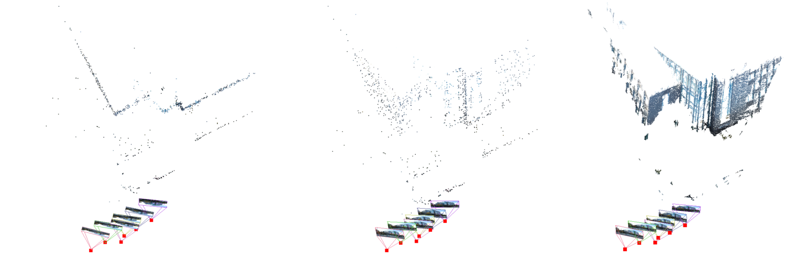

# Project Repository

This repository contains multiple projects related to computer vision and machine learning. Each project is briefly described below.

## Project Thumbnails

| Project | Description |
|---------|-------------|
|  | [NeRF (Neural Radiance Fields)](./NeRF): Synthesizing novel views of complex scenes using neural networks. |
|  | [Super Resolution](./Super_Resolution): Enhancing image resolution with advanced image processing and deep learning techniques. |
|  | [INR (Implicit Neural Representations)](./INR): Exploring implicit neural representations for various computer vision applications. |
|  | [Structure From Motion](./Structure_From_Motion): Reconstructing 3D scenes from 2D images by analyzing image motion and structure. |
|  | [Efficient ML](./Efficient_ML): Developing and implementing efficient machine learning models and algorithms. |

## 1. NeRF (Neural Radiance Fields)

### Overview

The NeRF (Neural Radiance Fields) project focuses on synthesizing novel views of complex scenes using neural networks.

### Usage

To run the NeRF project, follow the instructions in the [NeRF README](./NeRF/README.md).

...

<!-- Repeat the same structure for the other projects -->

## Contributing

If you would like to contribute to any of the projects, please check the individual project's README file for guidelines on contributing.

## License

This project is licensed under the [MIT License](LICENSE).
