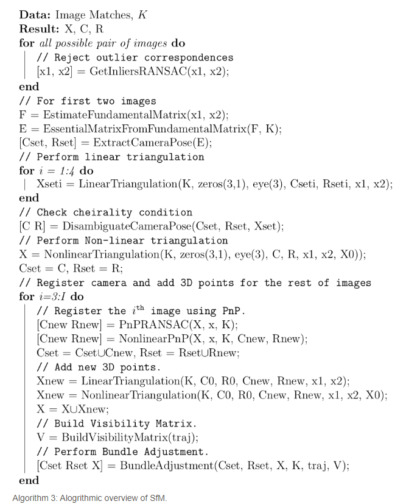
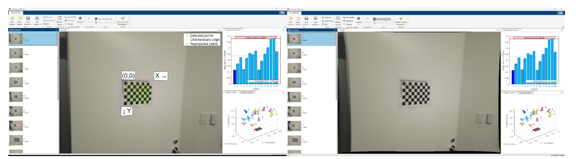
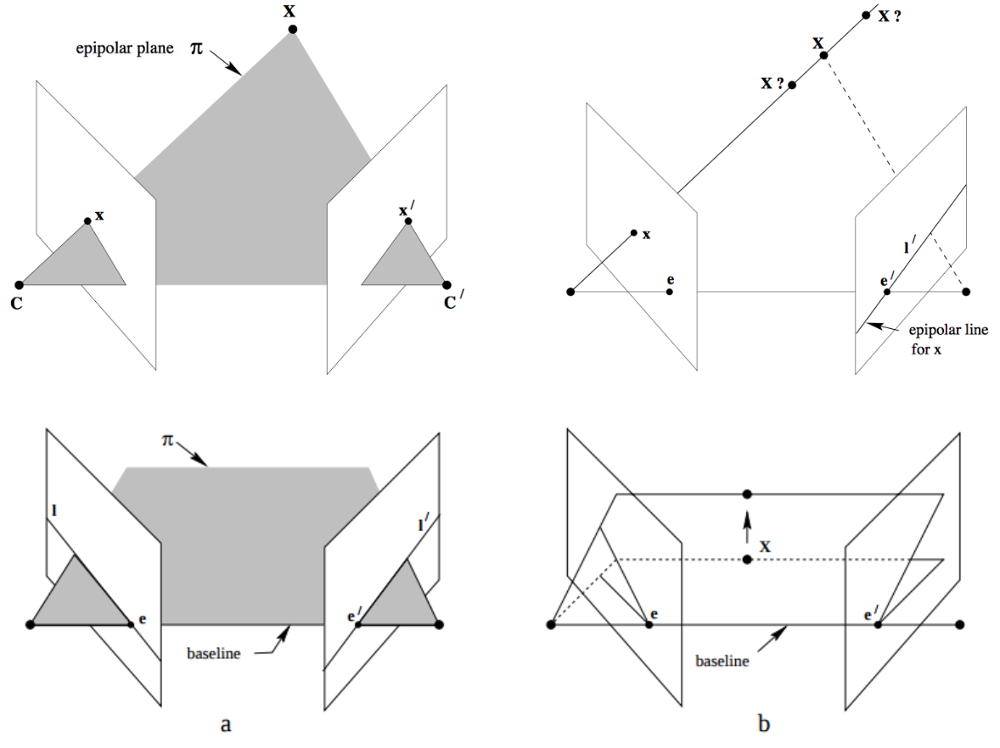
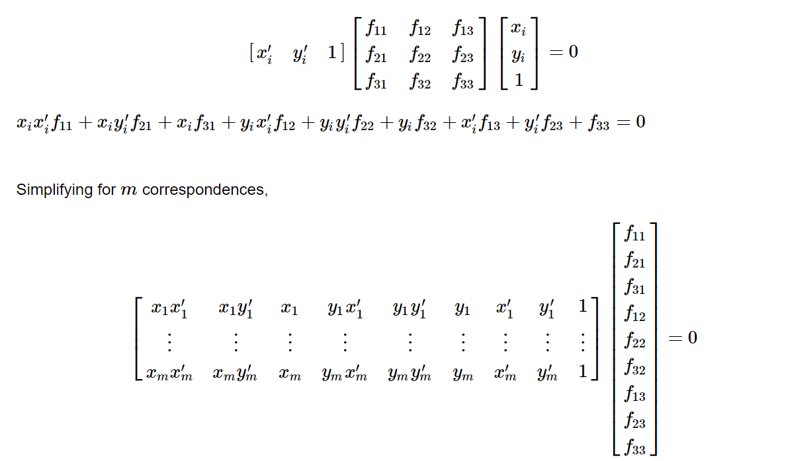
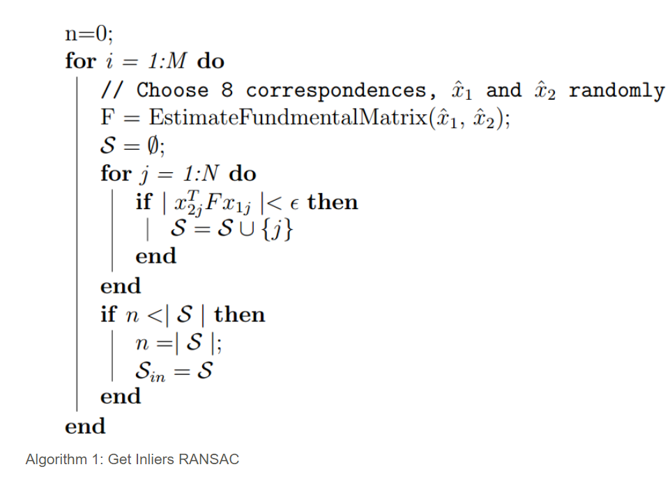

# SFM
For quite some time, images have been used predominantly in two-dimensional settings. However, it is possible to construct a three-dimensional scene and obtain the camera poses of a single camera with respect to the given scene. This process is referred to as Structure from Motion (SfM). The aim of SfM is to build a rigid structure using various images captured from different viewpoints, as if taken by a moving camera. Recently, Agarwal et al.'s publication, Building Rome in a Day, demonstrated the successful reconstruction of an entire city utilizing a vast collection of online photos.

Lets see the pseudo code for the same

Now lets break it into steps 

Steps for SFM:

*   **Feature Matching** and Outlier rejection using **RANSAC** **RAN**domly **SA**mpling **C**onsencus Algorithm. 
*   Estimating **Fundamental Matrix** and then **Essential Matrix**.
*   Estimate **Camera Pose** from Essential Matrix
*   Check for **Cheirality Condition** using **Triangulation**
*   **Perspective-n-Point**
*   **Bundle Adjustment**

## Data and Calibration 

Take a photo of a building and calibrate it. (Completely different project). In this, its calculated using matlab's Camera Calibrator Application.

## Approach to SFM 
### Feature Matching, Fundamental Matrix and Ransac
It is important to refine the matches by rejecting outline correspondence. Before rejecting the correspondences, let us first understand what Fundamental matrix is!

### Estimating Fundamental Matrix

The fundamental matrix, denoted by **F**, is a **3 X 3** (_rank 2_) matrix that relates the corresponding set of points in two images from different views (or stereo images). But in order to understand what fundamental matrix actually is, we need to understand what _epipolar geometry_ is! The epipolar geometry is the intrinsic projective geometry between two views. It only depends on the cameras’ internal parameters (**K**) matrix) and the relative pose _i.e._ it is **independent of the scene structure**.
#### Epipolar Geometry
*   **Epipole** is the point of intersection of the line joining the camera centers with the image plane. (see **e** and **e'**) in the above figure. 
*   **Epipolar plane** is the plane containing the baseline.
*   **Epipolar line** is the intersection of an epipolar plane with the image plane. _All the epipolar lines intersect at the epipole._

#### Fundamental Matrix **F**

#### Match Outlier Rejection via RANSAC

