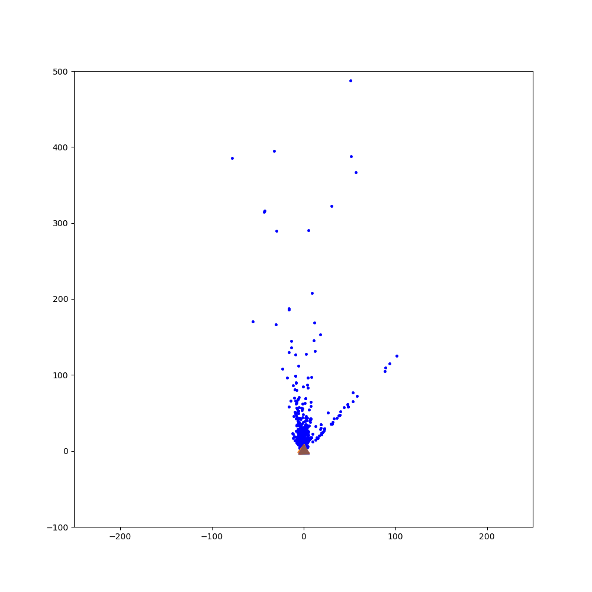

# SFM
For quite some time, images have been used predominantly in two-dimensional settings. However, it is possible to construct a three-dimensional scene and obtain the camera poses of a single camera with respect to the given scene. This process is referred to as Structure from Motion (SfM). The aim of SfM is to build a rigid structure using various images captured from different viewpoints, as if taken by a moving camera. Recently, Agarwal et al.'s publication, Building Rome in a Day, demonstrated the successful reconstruction of an entire city utilizing a vast collection of online photos.

Lets see the pseudo code for the same


Now lets break it into steps 

Steps for SFM:

*   **Feature Matching** and Outlier rejection using **RANSAC** **RAN**domly **SA**mpling **C**onsencus Algorithm. 
*   Estimating **Fundamental Matrix** and then **Essential Matrix**.
*   Estimate **Camera Pose** from Essential Matrix
*   Check for **Cheirality Condition** using **Triangulation**
*   **Perspective-n-Point**
*   **Bundle Adjustment**

## Data and Calibration 

Take a photo of a building and calibrate it. (Completely different project). In this, its calculated using matlab's Camera Calibrator Application.


## Approach to SFM 
### Feature Matching, Fundamental Matrix and Ransac
It is important to refine the matches by rejecting outline correspondence. Before rejecting the correspondences, let us first understand what Fundamental matrix is!

### Estimating Fundamental Matrix

The fundamental matrix, denoted by **F**, is a **3 X 3** (_rank 2_) matrix that relates the corresponding set of points in two images from different views (or stereo images). But in order to understand what fundamental matrix actually is, we need to understand what _epipolar geometry_ is! The epipolar geometry is the intrinsic projective geometry between two views. It only depends on the cameras’ internal parameters (**K**) matrix) and the relative pose _i.e._ it is **independent of the scene structure**.
#### Epipolar Geometry
*   **Epipole** is the point of intersection of the line joining the camera centers with the image plane. (see **e** and **e'**) in the above figure. 
*   **Epipolar plane** is the plane containing the baseline.
*   **Epipolar line** is the intersection of an epipolar plane with the image plane. _All the epipolar lines intersect at the epipole._


#### Fundamental Matrix **F**

#### Match Outlier Rejection via RANSAC


## Results 

### Quantitative Results 
#### Output
```
alse True
../outputs/   was not present, creating the folder...
Reading images from  ../Data/
At image :  0 1 || Number of inliers:  528 / 1426
At image :  0 2 || Number of inliers:  269 / 608
At image :  0 3 || Number of inliers:  168 / 470
At image :  1 2 || Number of inliers:  722 / 2052
At image :  1 3 || Number of inliers:  261 / 1073
At image :  2 3 || Number of inliers:  563 / 2293
At image :  2 4 || Number of inliers:  481 / 963
At image :  2 5 || Number of inliers:  248 / 449
At image :  3 4 || Number of inliers:  850 / 2160
At image :  3 5 || Number of inliers:  539 / 1151
At image :  4 5 || Number of inliers:  648 / 1965
Registering images 1 and 2 ...... 
Estimating poses of Camera 2
Done ### 
Performing NonLinear Triangulation...
1 2 Before optimization LT:  47.839135619144166 After optimization nLT: 44.923159491118454
Done ### 
 #####################  Registered Cameras 1 and 2 #####################
Registering remaining Images ......
Registering Image:  3 ......
Error after linear PnP:  1486.7397799388466  Error after non linear PnP:  698.5008070797918
Error after linear triangulation:  143.28291839622867  Error after non linear triangulation:  133.05968986867472
appended  287  points between  0  and  2
Error after linear triangulation:  1170183.0827264714  Error after non linear triangulation:  212.4492110708644
appended  782  points between  1  and  2
Performing Bundle Adjustment  for image :  2
5528 3969
   Iteration     Total nfev        Cost      Cost reduction    Step norm     Optimality   
       0              1         1.9691e+05                                    1.57e+06    
       1              8         1.9673e+05      1.80e+02       6.66e-01       1.67e+06    
       2             15         1.9673e+05      0.00e+00       0.00e+00       1.67e+06    
`xtol` termination condition is satisfied.
Function evaluations 15, initial cost 1.9691e+05, final cost 1.9673e+05, first-order optimality 1.67e+06.
time to run BA : 2.6409904956817627 s 
A matrix shape:  (5528, 3969) 
############
Error after BA : 306.3798625096779
Error after BA : 80.53812729999609
Error after BA : 102.55834763586772
##################### Registered Camera :  3 ######################
Registering Image:  4 ......
Error after linear PnP:  8061.30245081035  Error after non linear PnP:  2016.0667071266878
Error after linear triangulation:  1016458.7275099824  Error after non linear triangulation:  1061.7730573034025
appended  183  points between  0  and  3
Error after linear triangulation:  11229.116211924409  Error after non linear triangulation:  819.439226887069
appended  341  points between  1  and  3
Error after linear triangulation:  2762.5112069898278  Error after non linear triangulation:  268.7197940609159
appended  749  points between  2  and  3
Performing Bundle Adjustment  for image :  3
/home/aman/Downloads/SFM-master/Code/BundleAdjustment.py:148: VisibleDeprecationWarning: Creating an ndarray from ragged nested sequences (which is a list-or-tuple of lists-or-tuples-or ndarrays with different lengths or shapes) is deprecated. If you meant to do this, you must specify 'dtype=object' when creating the ndarray.
  RC_list = np.array(RC_list).reshape(-1, 6)
9088 6315
   Iteration     Total nfev        Cost      Cost reduction    Step norm     Optimality   
       0              1         2.0272e+08                                    4.71e+10    
       1              4         1.5632e+08      4.64e+07       5.90e+00       7.82e+09    
       2             14         1.5632e+08      0.00e+00       0.00e+00       7.82e+09    
`xtol` termination condition is satisfied.
Function evaluations 14, initial cost 2.0272e+08, final cost 1.5632e+08, first-order optimality 7.82e+09.
time to run BA : 4.320052146911621 s 
A matrix shape:  (9088, 6315) 
############
Error after BA : 2145.535756555708
Error after BA : 237799.36922839863
Error after BA : 136.8486606543045
Error after BA : 516.0429272811994
##################### Registered Camera :  4 ######################
Registering Image:  5 ......
Error after linear PnP:  36820.451551655955  Error after non linear PnP:  526.2965322800881
Error after linear triangulation:  304.35559412566863  Error after non linear triangulation:  141.27959952420855
appended  509  points between  2  and  4
Error after linear triangulation:  33.47504306519298  Error after non linear triangulation:  30.47979087161779
appended  944  points between  3  and  4
Performing Bundle Adjustment  for image :  4
13790 9570
   Iteration     Total nfev        Cost      Cost reduction    Step norm     Optimality   
       0              1         1.5720e+08                                    3.64e+09    
       1              5         1.5598e+08      1.22e+06       1.74e+00       3.63e+09    
       2              7         1.5597e+08      6.28e+03       1.37e-01       3.63e+09    
       3              8         1.5597e+08      7.11e+02       3.43e-02       3.63e+09    
       4              9         1.5597e+08      1.24e+02       8.58e-03       3.63e+09    
       5             10         1.5597e+08      2.75e+01       2.14e-03       3.63e+09    
       6             11         1.5597e+08      6.66e+00       5.36e-04       3.63e+09    
       7             12         1.5597e+08      1.65e+00       1.34e-04       3.63e+09    
       8             13         1.5597e+08      4.12e-01       3.35e-05       3.63e+09    
`xtol` termination condition is satisfied.
Function evaluations 13, initial cost 1.5720e+08, final cost 1.5597e+08, first-order optimality 3.63e+09.
time to run BA : 20.831254243850708 s 
A matrix shape:  (13790, 9570) 
############
Error after BA : 2126.793066130941
Error after BA : 235910.63462288215
Error after BA : 1051.8638713359614
Error after BA : 305.9050738679584
Error after BA : 33.26937761702679
##################### Registered Camera :  5 ######################
Registering Image:  6 ......
Error after linear PnP:  13796.626430628392  Error after non linear PnP:  1609.8902044837841
Error after linear triangulation:  259.3253811725487  Error after non linear triangulation:  242.1769038145077
appended  274  points between  2  and  5
Error after linear triangulation:  242.16323473652645  Error after non linear triangulation:  192.8627505819323
appended  582  points between  3  and  5
Error after linear triangulation:  40922.06876035547  Error after non linear triangulation:  795.157646481163
appended  757  points between  4  and  5
Performing Bundle Adjustment  for image :  5
18062 12315
   Iteration     Total nfev        Cost      Cost reduction    Step norm     Optimality   
       0              1         1.6105e+08                                    6.95e+09    
       1             14         1.6105e+08      0.00e+00       0.00e+00       6.95e+09    
`xtol` termination condition is satisfied.
Function evaluations 14, initial cost 1.6105e+08, final cost 1.6105e+08, first-order optimality 6.95e+09.
time to run BA : 5.761162281036377 s 
A matrix shape:  (18062, 12315) 
############
Error after BA : 2126.793066130941
Error after BA : 235910.63462288317
Error after BA : 3644.6466597213885
Error after BA : 2368.626813758831
Error after BA : 121.30529512282968
Error after BA : 406.5246165746999
##################### Registered Camera :  6 ######################
##########################################################################

```

### Qualitative Results



